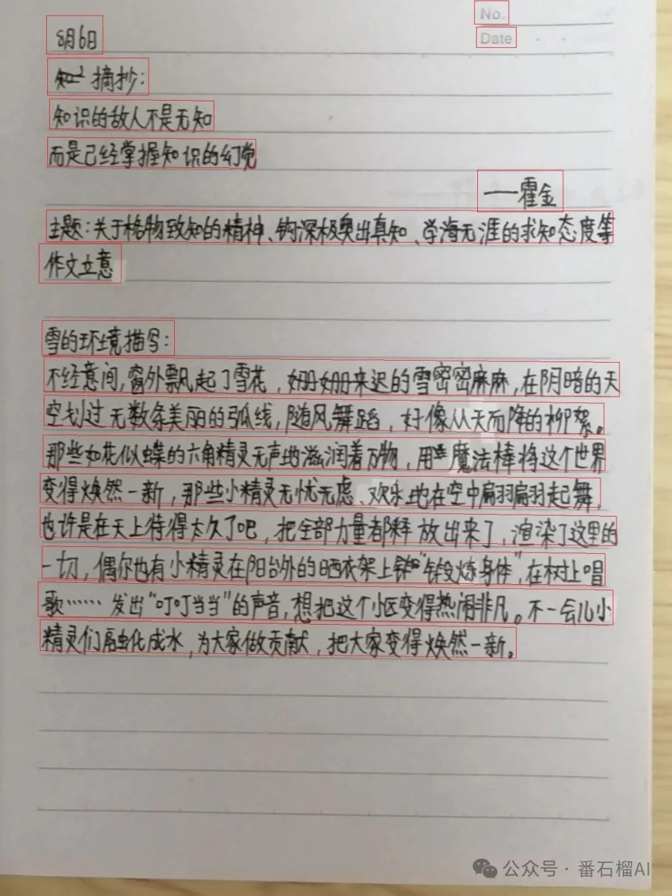
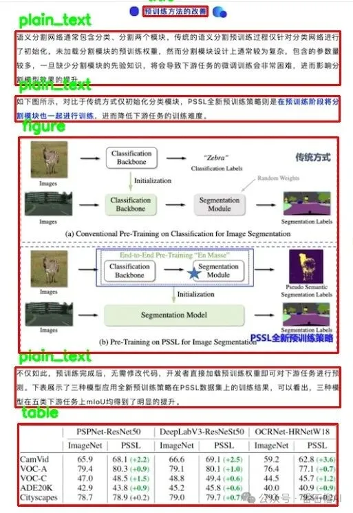
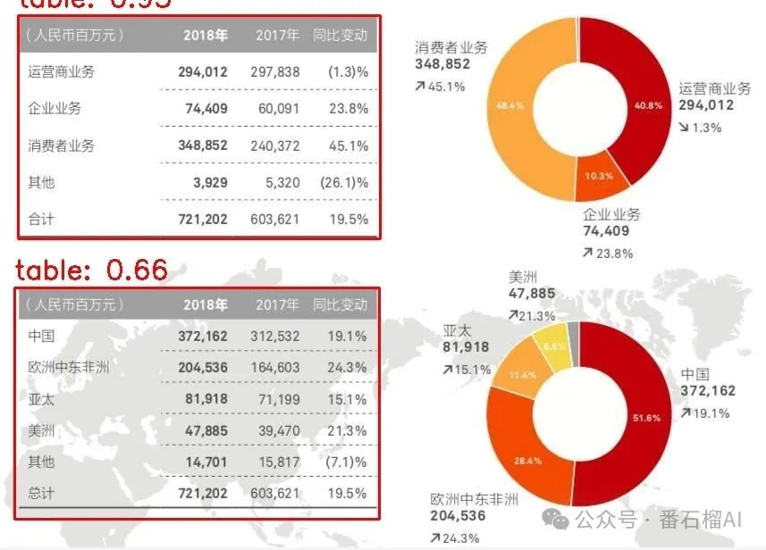
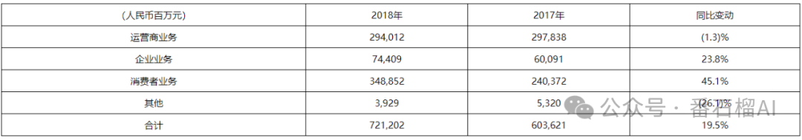

# JiaJiaOCR

[](readme_en.md)

## 🚀 Java OCR解决方案

在 OCR 技术落地过程中，Java 开发者常面临 **"Python 生态繁荣，Java 集成困难"** 的困境 —— 要么依赖jni调用 exe/dll 外部文件，要么跨平台部署踩坑不断。

**JiaJiaOCR 为您带来革命性突破！** 🎉

本项目将同步更新升级轻量级版本和全功能版本：

| 版本 | 大小 | 核心功能 | 适用场景 |
|------|------|----------|----------|
| **🔥 轻量版 (1.0+)** | 21MB+ | 通用OCR识别 | 快速集成、资源受限环境 |
| **⚡ 全功能版 (2.0+)** | 200MB+ | 通用OCR+手写OCR+版面检测+表格识别 | 企业级应用、复杂文档处理 |

---

## 📦 版本更新速览

### 🔥 轻量版 (1.0+) - 精简高效
- ✅ **v1.0.1** - 优化英文OCR空白识别 → 返回空串而非null
- ✅ **v1.0.2** - 新增PDF识别支持

### ⚡ 全功能版 (2.0+) - 功能全面
- ✅ **v2.0.1** - 优化英文OCR空白识别 → 返回空串而非null
- ✅ **v2.0.2** - 新增PDF识别支持
- 🚀 **性能提升40%** - 模型懒加载机制，按需加载
- 🎯 **功能扩容** - 新增手写OCR、版面检测、表格检测与识别
- 📊 **结果升级** - 新增版面元素坐标、表格HTML格式输出

---

## 🎯 四大核心功能详解

### 1. 📝 通用OCR：印刷体识别标杆
延续 1.0 + 版本的高精度印刷体识别能力，支持中英文、数字、符号混合识别，返回文本内容与坐标，适用于发票、标签、广告牌等印刷体场景。

### 2. ✍️ 手写OCR：突破手写识别难点
新增针对中文手写体的专项优化模型，支持工整手写、连笔手写等常见手写风格，解决手写笔记数字化、手写表单录入等痛点，识别准确率达 **92% 以上**（标准手写样本测试）。

### 3. 📋 版面检测：文档结构智能解析
可自动识别文档中的标题、段落、图片、表格等版面元素，返回各元素的坐标与类型标签，为文档结构化处理提供基础，适用于 PDF 转 Word、古籍数字化等场景。

### 4. 📊 表格检测与识别：结构化数据直接提取
业内少有的纯 Java 表格识别方案，支持表格区域检测、单元格分割、内容识别全流程，最终输出 HTML 格式的结构化结果，可直接渲染为表格或导入 Excel，彻底告别手动录入表格数据的繁琐。

---

## 🛠️ 快速上手：5分钟集成教程

### 📋 环境准备
- **开发环境**：JDK 8 及以上版本
- **运行环境**：Windows 10+、Linux x86_64
- **依赖管理**：Maven（推荐）

### 📦 引入依赖与 Jar 包

#### 第一步：添加 Maven 依赖

```xml
<dependencies>
    <!-- ONNX Runtime：模型推理核心依赖 -->
    <dependency>
        <groupId>com.microsoft.onnxruntime</groupId>
        <artifactId>onnxruntime</artifactId>
        <version>1.19.0</version>
    </dependency>
    <!-- DJL MXNet引擎：深度学习框架支持 -->
    <dependency>
        <groupId>ai.djl.mxnet</groupId>
        <artifactId>mxnet-engine</artifactId>
        <version>0.31.0</version>
    </dependency>
    <!-- OpenCV：图像处理依赖 -->
    <dependency>
        <groupId>ai.djl.opencv</groupId>
        <artifactId>opencv</artifactId>
        <version>0.31.0</version>
    </dependency>
    <!-- DJL核心API：模型管理 -->
    <dependency>
        <groupId>ai.djl</groupId>
        <artifactId>api</artifactId>
        <version>0.31.0</version>
    </dependency>
   <!-- 操作pdf -->
    <dependency>
        <groupId>org.apache.pdfbox</groupId>
        <artifactId>pdfbox</artifactId>
        <version>3.0.2</version>
    </dependency>
</dependencies>
```

#### 第二步：下载核心 Jar 包

前往 GitHub 仓库[JiaJiaOCR](https://github.com/jiangnanboy/JiaJiaOCR) releases 页面，下载 JiaJiaOCR 2.0 + 版本的 jar 包，放入项目依赖目录并引入。该 Jar 包 200MB（集成了模型文件）。

### 💻 完整功能示例代码

```java
import com.jiajia.common_object.*;
import com.jiajia.core.JiaJiaOCR;
import org.apache.commons.lang3.tuple.Pair;
import org.opencv.core.Mat;
import org.opencv.core.MatOfPoint;
import org.opencv.core.Point;
import org.opencv.core.Scalar;
import org.opencv.imgcodecs.Imgcodecs;
import org.opencv.imgproc.Imgproc;
import java.util.ArrayList;
import java.util.List;
import static com.jiajia.common_object.PdfConvert.convertPdfToImages;

/**
 * JiaJiaOCR 2.0 全功能示例
 * @author sy
 * @date 2025/12/4 15:56
 */
public class JiaJiaOCR2Demo {
    public static void main(String...args) {
        String imgPath = "test.jpg"; // 替换为你的图片路径

        // 🚀 按需解锁功能（注释解开即可使用）
        // generalOCRTest(imgPath);    // 1.通用OCR（印刷体）
        // handwrittingOCRTest(imgPath); // 2.手写OCR
        // layoutDetTest(imgPath);     // 3.版面检测（带可视化）
        // tableDetTest(imgPath);      // 4.表格检测（带可视化）
        // tableRecTest(imgPath);      // 5.表格识别（输出HTML）
        // tableDetRecTest(imgPath);   // 6.表格检测+识别（一站式）
        // textLineDetText(imgPath);   // 7.文本行检测（带可视化）
        // pdfOCR();                   // 8.这是pdf识别示例 
    }

    /**
     * 1. 通用OCR（印刷体识别）
     * @param imgPath 图片路径
     */
    public static void generalOCRTest(String imgPath) {
        // 懒加载初始化：此时不加载任何模型
        JiaJiaOCR jiaJiaOCR = JiaJiaOCR.builder();
        // 调用功能时才加载对应模型
        List<Pair<Text, Box>> result = jiaJiaOCR.recognizeGeneralText(imgPath);
        // 输出：文本内容+四边形坐标
        System.out.println("通用OCR结果：" + result);
    }
    
    /**
     * 2. 手写OCR识别
     * @param imgPath 图片路径
     */
    public static void handwrittingOCRTest(String imgPath) {
        JiaJiaOCR jiaJiaOCR = JiaJiaOCR.builder();
        List<Pair<Text, Box>> result = jiaJiaOCR.recognizeHandwrittenText(imgPath);
        System.out.println("手写OCR结果：" + result);
    }
    
    /**
     * 3. 版面检测（识别标题/段落/表格等元素，带可视化）
     * @param imgPath 图片路径
     */
    public static void layoutDetTest(String imgPath) {
        JiaJiaOCR jiaJiaOCR = JiaJiaOCR.builder();
        List<Layout> layoutList = jiaJiaOCR.detectLayout(imgPath);
        // 可视化检测结果并保存
        Mat img = Imgcodecs.imread(imgPath);
        drawLayoutPredictions(img, layoutList);
        Imgcodecs.imwrite("layout_result.jpg", img);
        System.out.println("版面检测结果已保存，元素信息：" + layoutList);
    }
    
    /**
     * 4. 表格检测（仅检测表格区域，带可视化）
     * @param imgPath 图片路径
     */
    public static void tableDetTest(String imgPath) {
        JiaJiaOCR jiaJiaOCR = JiaJiaOCR.builder();
        List<DetectionResult> tableList = jiaJiaOCR.detectTables(imgPath);
        // 可视化表格区域
        Mat img = Imgcodecs.imread(imgPath);
        Mat resultMat = drawTableResults(img, tableList);
        Imgcodecs.imwrite("table_detect_result.jpg", resultMat);
        System.out.println("表格检测区域：" + tableList);
    }
    
    /**
     * 5. 表格识别（基于通用OCR结果提取表格结构，输出HTML）
     * @param imgPath 图片路径
     */
    public static void tableRecTest(String imgPath) {
        JiaJiaOCR jiaJiaOCR = JiaJiaOCR.builder();
        // 先获取通用OCR结果
        List<Pair<Text, Box>> ocrResult = jiaJiaOCR.recognizeGeneralText(imgPath);
        // 基于OCR结果提取表格结构
        TableResult tableResult = jiaJiaOCR.recognizeTableFromOCR(imgPath, ocrResult);
        // 输出HTML格式（可直接渲染）
        System.out.println("表格识别HTML结果：" + tableResult.getHtmlContent());
    }
    
    /**
     * 6. 表格检测+识别一站式调用
     * @param imgPath 图片路径
     */
    public static void tableDetRecTest(String imgPath) {
        JiaJiaOCR jiaJiaOCR = JiaJiaOCR.builder();
        // 一步获取表格结构化结果
        List<TableResult> tableResults = jiaJiaOCR.recognizeTables(imgPath);
        for (TableResult table : tableResults) {
            System.out.println("表格HTML：" + table.getHtmlContent());
            System.out.println("表格坐标：" + table.getBox());
        }
    }
    
    /**
     * 7. 文本行检测（带可视化）
     * @param imgPath 图片路径
     */
    public static void textLineDetText(String imgPath) {
        JiaJiaOCR jiaJiaOCR = JiaJiaOCR.builder();
        Boxes textLines = jiaJiaOCR.detectTextLines(imgPath);
        // 可视化文本行
        Mat img = Imgcodecs.imread(imgPath);
        drawTextLinePredictions(img, textLines);
        Imgcodecs.imwrite("textline_result.jpg", img);
        System.out.println("文本行检测结果：" + textLines);
    }

    /**
     * 8. pdf识别
     */
    public static void pdfOCR() throws IOException, OrtException {
        String pdfPath = "How_To.pdf";
        String pdfOutputDir = "pdf_image"; // pdf转为图片的保存目录
        JiaJiaOCR jiaJiaOCR = JiaJiaOCR.builder();

        List<String> pdfPathList = convertPdfToImages(pdfPath, pdfOutputDir);
        for(String pdfImgPath:pdfPathList) {
            List<Pair<Text, Box>> pairList = jiaJiaOCR.recognizeGeneralText(pdfImgPath);
            System.out.println(pairList);
        }
    }

    // ------------------- 可视化工具方法 -------------------
    /**
     * 绘制版面检测结果
     */
    public static void drawLayoutPredictions(Mat img, List<Layout> detLayout) {
        for(Layout layout : detLayout) {
            int[] bbox = layout.getBbox();
            // 绘制矩形框（红色，线宽2）
            Imgproc.rectangle(img, new Point(bbox[0], bbox[1]), 
                             new Point(bbox[2], bbox[3]), new Scalar(0, 0, 255), 2);
            // 绘制元素标签（绿色文字）
            String label = layout.getLabel();
            Imgproc.putText(img, label, new Point(bbox[0]+5, bbox[1]-10), 
                           Imgproc.FONT_HERSHEY_SIMPLEX, 0.7, new Scalar(0, 255, 0), 2);
        }
    }
    
    /**
     * 绘制表格检测结果
     */
    public static Mat drawTableResults(Mat image, List<DetectionResult> results) {
        Mat resultImg = image.clone();
        for (DetectionResult result : results) {
            String label = "表格：" + String.format("%.2f", result.getConfidence());
            // 绘制标签与矩形框
            Imgproc.putText(resultImg, label, new Point(result.getRect().x, result.getRect().y-10),
                           Imgproc.FONT_HERSHEY_SIMPLEX, 1.0, new Scalar(0, 0, 255), 2);
            Imgproc.rectangle(resultImg, new Point(result.getRect().x, result.getRect().y),
                           new Point(result.getRect().x+result.getRect().width, 
                                     result.getRect().y+result.getRect().height),
                           new Scalar(0, 0, 255), 2);
        }
        return resultImg;
    }
    
    /**
     * 绘制文本行检测结果（多边形适配任意角度）
     */
    public static void drawTextLinePredictions(Mat img, Boxes detBoxes) {
        List<Box> boxList = detBoxes.getBoxes();
        for(Box box : boxList) {
            double[] pos = box.getLinePosition();
            // 构建四边形顶点
            Point[] points = new Point[4];
            points[0] = new Point(pos[0], pos[1]);
            points[1] = new Point(pos[2], pos[3]);
            points[2] = new Point(pos[4], pos[5]);
            points[3] = new Point(pos[6], pos[7]);
            // 绘制多边形（红色，线宽1）
            MatOfPoint polygon = new MatOfPoint(points);
            List<MatOfPoint> polygons = new ArrayList<>();
            polygons.add(polygon);
            Imgproc.polylines(img, polygons, true, new Scalar(0, 0, 255), 1);
        }
    }
}
```

---

## 📊 关键返回结果说明

JiaJiaOCR 2.0 提供结构化、易解析的返回结果，覆盖不同功能场景需求：

| 功能模块            | 核心返回内容      | 数据格式说明                                       |
| --------------- | ----------- | -------------------------------------------- |
| 通用 OCR / 手写 OCR | 文本内容、坐标、置信度 | `List<Pair<Text, Box>>`，Text 含内容与置信度，Box 含 8 个顶点坐标         |
| 版面检测            | 元素类型、坐标、置信度 | `List<Layout>`，含 label（标题 / 段落等）、bbox（矩形坐标）          |
| 表格检测            | 表格区域、置信度    | `List<DetectionResult>`，含矩形坐标与置信度                             |
| 表格识别            | 表格结构、内容、坐标  | `TableResult`，含 htmlContent（HTML 格式）、box（坐标） |

---

## 🖼️ 效果展示

### 📝 通用OCR效果


### ✍️ 手写OCR效果


### 📋 版面检测效果


### 📊 表格检测效果


### 📈 表格识别效果


---

## 📞 联系我

如有想法或问题，欢迎随时联系：

1. 🐙 **GitHub**：[jiangnanboy](https://github.com/jiangnanboy)
2. 💬 **QQ**：2229029156
3. 📧 **Email**：2229029156@qq.com

---

## ⭐ 支持我们

如果这个项目对您有帮助，请给我们一个 **Star**！您的支持是我们持续改进的动力 ❤️

[](https://github.com/jiangnanboy/JiaJiaOCR/stargazers)
