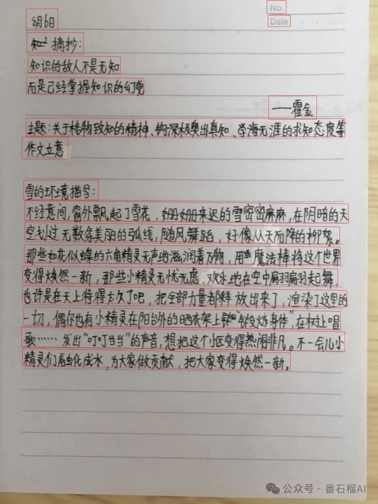
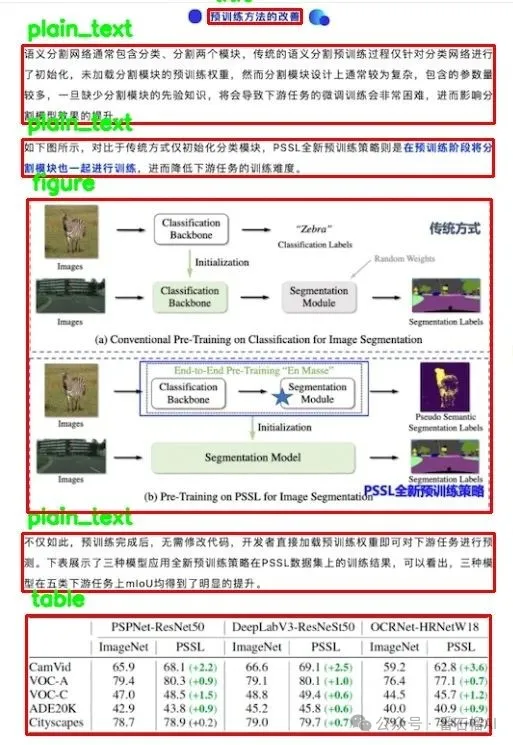
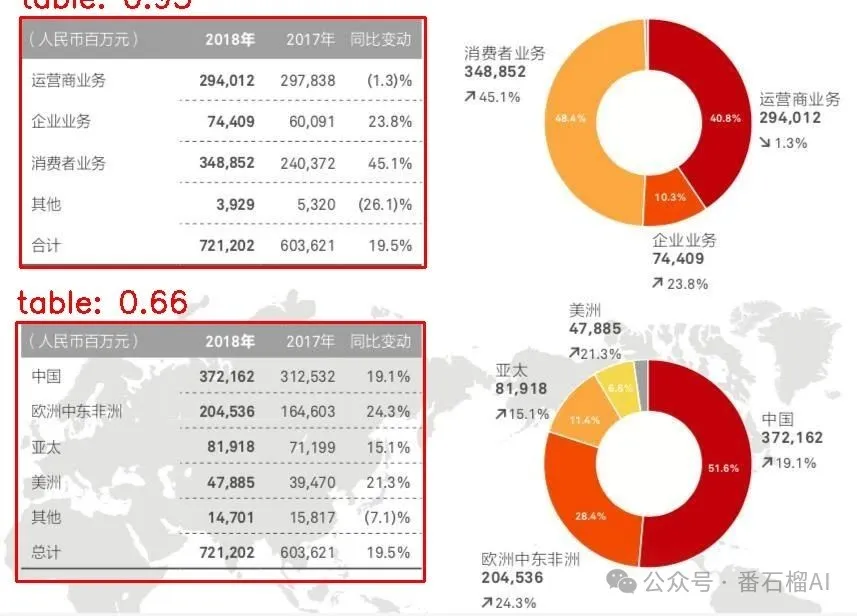
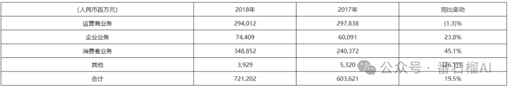

# JiaJiaOCR

[](README_CN.md)

## 🚀 Java OCR Solution

Java developers always struggle with OCR integration pain points: the Python OCR ecosystem is mature, while Java lacks convenient native solutions\. Traditional Java OCR implementations rely on JNI to invoke external EXE/DLL binaries, leading to painful cross\-platform deployment\.

**JiaJiaOCR brings a revolutionary solution for Java OCR implementation\!** 🎉

This project features pure Java implementation, lightweight footprint and comprehensive capabilities with zero complicated configuration for out\-of\-box usage\. Two major editions are maintained continuously to satisfy diverse business requirements\.

### 📌 Edition Overview

|Edition|Size|Core Features|Application Scenarios|Runtime Requirement|
|---|---|---|---|---|
|**🔥 Lite Edition \(1\.0\+\)**|21MB\+|General OCR, PDF OCR|Quick integration, resource\-limited environment, basic text extraction|JDK8\+|
|**⚡ Full Edition \(2\.0\+ / 2\.1\.0\)**|200MB\+|General OCR \+ Handwriting OCR \+ Layout Analysis \+ Table Recognition \+ PDF OCR; v2\.1\.0 adds memory leak fix, table JSON output \& task cancellation|Enterprise document processing, complex structured document parsing, bulk batch recognition|v2\.0\.x: JDK8\+ / **v2\.1\.0: JDK11\+ \(Mandatory\)**|

---

## 📦 Release Changelog

### 🔥 Lite Edition \(1\.0\+\) \- Compact \& Minimal

- ✅ **v1\.0\.1**: Optimize blank English OCR result to return empty string instead of `null` to avoid NPE

- ✅ **v1\.0\.2**: Add multi\-page PDF recognition support

### ⚡ Full Edition Update Log

#### v2\.0\.x Base Version

- ✅ **v2\.0\.1**: Fix empty English recognition to return empty string instead of `null`

- ✅ **v2\.0\.2**: Integrate PDF document OCR capability

- 🚀 Performance Boost: Implement lazy model loading to reduce initial memory overhead

- 🎯 Feature Expansion: Introduce handwriting OCR, document layout detection, full table detection \& recognition

- 📊 Result Upgrade: Return bounding box coordinates for layout elements \+ HTML formatted table result

#### ✨ v2\.1\.0 Latest Stable Release \(Recommended\)

**Mandatory Runtime: JDK 11 or higher**

Core improvements \& new features:

- 🔧 Memory Optimization: Fix multiple memory leaks to enhance stability for long\-running \& bulk recognition jobs

- 📋 Enhanced Table Output: Apart from original HTML format, add structured JSON output containing precise row \& column information for downstream secondary development

- ⏹️ New Task Cancellation API: Support aborting long\-running recognition tasks dynamically for flexible business exception handling

- 🧵 Multi\-threading Improvement: Optimize concurrent batch processing for multi\-image \& multi\-file workloads

---

## 🎯 Four Core Capabilities

### 1\. 📝 General OCR: High\-precision Printed Text Recognition

Deliver stable high accuracy for mixed Chinese, English, digits and symbols\. Returns recognized text content, confidence score and 8\-point quadrilateral coordinates\. Ideal for invoices, labels, posters and standard printed documents\.

### 2\. ✍️ Handwriting OCR: Optimized for Chinese Manuscript

Custom\-trained model for Chinese handwriting covering neat script \& casual cursive handwriting\. Perfect for handwritten note digitization and manual form data entry\. **Test accuracy reaches over 92% on standard handwriting dataset**\.

### 3\. 📋 Document Layout Analysis

Automatically categorize document components including title, paragraph, image and table with classification label, confidence value and bounding box coordinates\. Enables PDF\-to\-Word conversion, ancient document digitization and structured document archiving\.

### 4\. 📊 Table Detection \& Structured Recognition: Pure\-Java Table Parsing Solution

Rare pure\-Java end\-to\-end table pipeline: table region detection → cell segmentation → content recognition\.

**v2\.1\.0 Major Upgrade**: Dual output formats:

- HTML: Directly rendered on web pages

- Structured JSON: Contains detailed row/column metadata for Excel/database importing, eliminating manual table transcription entirely\.

---

## 🛠️ Quick Start: Integrate within 5 Minutes

### 📋 Environment Prerequisite

- Lite Edition 1\.0\+: JDK8\+

- Full Edition 2\.0\.x: JDK8\+

- **Full Edition 2\.1\.0: JDK11\+ \(Required\)**

- Supported OS: Windows 10\+, Linux x86\_64

- Build Tool: Maven \(Recommended\)

### 📦 Add Maven Dependencies

Shared pom\.xml dependency for 2.1.0 editions:

```XML
<dependencies>
    <dependency>
        <groupId>com.microsoft.onnxruntime</groupId>
        <artifactId>onnxruntime</artifactId>
        <version>1.19.0</version>
    </dependency>
    <dependency>
        <groupId>org.openpnp</groupId>
        <artifactId>opencv</artifactId>
        <version>4.9.0-0</version>
    </dependency>
    <dependency>
        <groupId>org.apache.pdfbox</groupId>
        <artifactId>pdfbox</artifactId>
        <version>3.0.2</version>
    </dependency>
</dependencies>
```

### 📥 Import Core Jar Package

Download target jar from [GitHub Release Page](https://github.com/jiangnanboy/JiaJiaOCR/releases):

- Lite 1\.0\+: Small\-size jar for basic general \& PDF OCR only

- Full 2\.1\.0 \(Recommended\): 200MB\+ pre\-packed with all inference models and latest features

Place downloaded jar into project lib directory and add to build path\.

### 💻 Full Demo Code for v2\.1\.0

Covers all core features including new JSON table export, runtime cancel \& multi\-thread batch processing; directly compilable \& runnable:

See details：JiaJiaOCRFullTest.java

```Java
import com.jiajia.common_object.*;
import com.jiajia.core.JiaJiaOCR;
import org.apache.commons.lang3.tuple.Pair;
import org.opencv.core.Mat;
import org.opencv.core.MatOfPoint;
import org.opencv.core.Point;
import org.opencv.core.Scalar;
import org.opencv.imgcodecs.Imgcodecs;
import org.opencv.imgproc.Imgproc;

import java.awt.image.BufferedImage;
import java.io.File;
import java.io.IOException;
import java.util.ArrayList;
import java.util.List;

import static com.jiajia.common_object.PdfConvert.convertPdfToImages;

/**
 * JiaJiaOCR v2.1.0 Full Function Demo
 * Requires JDK11+, contains all newly added features
 * Features covered: General OCR | Handwriting OCR | Layout Detection | Textline Detection | Table Parse | PDF OCR | Task Cancel | Multi-thread Batch
 */
public class JiaJiaOCRFullTest {

    // ========== Configure your local file paths ==========
    private static final String GENERAL_OCR_IMG = "general_ocr.jpg";
    private static final String HANDWRITING_IMG = "handwriting_ocr.jpg";
    private static final String LAYOUT_IMG = "layout.jpg";
    private static final String TABLE_DET_REC_IMG = "table_det_rec.jpg";
    private static final String TABLE_REC_IMG = "table_rec.png";
    private static final String PDF_PATH = "pdf.pdf";
    private static final String OUTPUT_DIR = "test_output";

    public static void main(String[] args) throws Exception {
        new File(OUTPUT_DIR).mkdirs();

        System.out.println("========================================");
        System.out.println("     JiaJiaOCR 2.1.0 Full Feature Test");
        System.out.println("========================================\n");

        // 1. General printed OCR
        if (new File(GENERAL_OCR_IMG).exists()) {
            System.out.println("【Test 1】General OCR - Printed Text Recognition");
            testGeneralOCR(GENERAL_OCR_IMG);
            System.out.println();
        }

        // 2. Handwriting OCR
        if (new File(HANDWRITING_IMG).exists()) {
            System.out.println("【Test 2】Handwriting OCR");
            testHandwritingOCR(HANDWRITING_IMG);
            System.out.println();
        }

        // 3. Document Layout Analysis
        if (new File(LAYOUT_IMG).exists()) {
            System.out.println("【Test 3】Document Layout Detection");
            testLayoutDetection(LAYOUT_IMG);
            System.out.println();
        }

        // 4. Text line detection
        if (new File(GENERAL_OCR_IMG).exists()) {
            System.out.println("【Test 4】Text Line Location Detection");
            testTextLineDetection(GENERAL_OCR_IMG);
            System.out.println();
        }

        // 5. Pure table region detection
        if (new File(TABLE_DET_REC_IMG).exists()) {
            System.out.println("【Test 5】Table Region Detection");
            testTableDetection(TABLE_DET_REC_IMG);
            System.out.println();
        }

        // 6. Table parse from existing OCR result
        if (new File(TABLE_REC_IMG).exists()) {
            System.out.println("【Test 6】Structured Table Recognition (HTML+JSON)");
            testTableRecognition(TABLE_REC_IMG);
            System.out.println();
        }

        // 7. One-shot table detect + parse
        if (new File(TABLE_DET_REC_IMG).exists()) {
            System.out.println("【Test 7】All-in-one Table Detect & Parse");
            testTableDetRec(TABLE_DET_REC_IMG);
            System.out.println();
        }

        // 8. New Feature: Task Cancel Demo
        if (new File(GENERAL_OCR_IMG).exists()) {
            System.out.println("【Test 8】New Feature: Recognition Task Cancellation");
            testCancellation(GENERAL_OCR_IMG);
            System.out.println();
        }

        // 9. New Feature: Multi-thread Batch Processing
        if (new File(GENERAL_OCR_IMG).exists()) {
            System.out.println("【Test 9】New Feature: Multi-thread Batch Recognition");
            testMultiThreadBatch(new String[]{GENERAL_OCR_IMG, GENERAL_OCR_IMG, GENERAL_OCR_IMG});
            System.out.println();
        }

        //10. Multi-page PDF OCR
        if (new File(PDF_PATH).exists()) {
            System.out.println("【Test10】Multi-page PDF Bulk OCR");
            testPdfOCR(PDF_PATH);
            System.out.println();
        }

        System.out.println("========================================");
        System.out.println("         All Test Cases Finished!");
        System.out.println("========================================");
    }

    // 1. General Printed OCR
    public static void testGeneralOCR(String imgPath) throws Exception {
        JiaJiaOCR ocr = JiaJiaOCR.builder();
        try {
            List<Pair<Text, Box>> results = ocr.recognizeGeneralText(imgPath);
            System.out.println("  Total recognized text blocks: " + results.size());
            for (int i = 0; i < results.size(); i++) {
                Pair<Text, Box> pair = results.get(i);
                System.out.println("  Text " + (i + 1) + "：" + pair.getLeft().getText());
            }
        } finally {
            ocr.close();
        }
    }

    // 2. Handwriting OCR
    public static void testHandwritingOCR(String imgPath) throws Exception {
        JiaJiaOCR ocr = JiaJiaOCR.builder();
        try {
            List<Pair<Text, Box>> results = ocr.recognizeHandwrittenText(imgPath);
            System.out.println("  Total handwriting blocks: " + results.size());
            for (Pair<Text, Box> pair : results) {
                System.out.println("  Handwritten Content：" + pair.getLeft().getText());
            }
        } finally {
            ocr.close();
        }
    }

    // 3. Layout Detection & Visualization
    public static void testLayoutDetection(String imgPath) throws Exception {
        JiaJiaOCR ocr = JiaJiaOCR.builder();
        try {
            List<Layout> layouts = ocr.detectLayout(imgPath);
            System.out.println("  Detected layout elements count: " + layouts.size());

            Mat img = Imgcodecs.imread(imgPath);
            for (Layout layout : layouts) {
                int x0 = (int) layout.getBbox()[0];
                int y0 = (int) layout.getBbox()[1];
                int x1 = (int) layout.getBbox()[2];
                int y1 = (int) layout.getBbox()[3];

                Imgproc.rectangle(img, new Point(x0, y0), new Point(x1, y1),
                        new Scalar(0, 0, 255), 2);
                Imgproc.putText(img, layout.getLabel(),
                        new Point(Math.max(0, x0 + 5), Math.max(0, y0 - 10)),
                        Imgproc.FONT_HERSHEY_SIMPLEX, 0.7,
                        new Scalar(0, 255, 0), 2, Imgproc.LINE_AA);

                System.out.println("  Element Type：" + layout.getLabel() +
                        "，Confidence：" + String.format("%.2f", layout.getConfidence()));
            }

            String outputPath = OUTPUT_DIR + "/layout_result.jpg";
            Imgcodecs.imwrite(outputPath, img);
            System.out.println("  Rendered image saved to: " + outputPath);
            img.release();
        } finally {
            ocr.close();
        }
    }

    // 4. Text Line Detection
    public static void testTextLineDetection(String imgPath) throws Exception {
        JiaJiaOCR ocr = JiaJiaOCR.builder();
        try {
            Boxes boxes = ocr.detectTextLines(imgPath);
            List<Box> boxList = boxes.getBoxes();
            System.out.println("  Detected text line count: " + boxList.size());

            Mat img = Imgcodecs.imread(imgPath);
            for (Box box : boxList) {
                Point[] points = new Point[4];
                float[] pos = box.getLinePosition();
                points[0] = new Point(pos[0], pos[1]);
                points[1] = new Point(pos[2], pos[3]);
                points[2] = new Point(pos[4], pos[5]);
                points[3] = new Point(pos[6], pos[7]);

                MatOfPoint polygon = new MatOfPoint(points);
                List<MatOfPoint> polygons = new ArrayList<>();
                polygons.add(polygon);
                Imgproc.polylines(img, polygons, true, new Scalar(0, 0, 255), 2);
            }

            String outputPath = OUTPUT_DIR + "/textline_result.jpg";
            Imgcodecs.imwrite(outputPath, img);
            System.out.println("  Rendered image saved to: " + outputPath);
            img.release();
        } finally {
            ocr.close();
        }
    }

    // 5. Table Region Detection Only
    public static void testTableDetection(String imgPath) throws Exception {
        JiaJiaOCR ocr = JiaJiaOCR.builder();
        try {
            List<DetectionResult> results = ocr.detectTables(imgPath);
            System.out.println("  Detected table count: " + results.size());

            Mat img = Imgcodecs.imread(imgPath);
            for (DetectionResult result : results) {
                String label = result.getClassLabel() + ": " +
                        String.format("%.2f", result.getConfidence());
                Imgproc.putText(img, label,
                        new Point(result.getRect().x, result.getRect().y - 10),
                        Imgproc.FONT_HERSHEY_SIMPLEX, 1.0, new Scalar(0, 0, 255), 2);
                Imgproc.rectangle(img,
                        new Point(result.getRect().x, result.getRect().y),
                        new Point(result.getRect().x + result.getRect().width,
                                result.getRect().y + result.getRect().height),
                        new Scalar(0, 0, 255), 2);
            }

            String outputPath = OUTPUT_DIR + "/table_detection_result.jpg";
            Imgcodecs.imwrite(outputPath, img);
            System.out.println("  Rendered image saved to: " + outputPath);
            img.release();
        } finally {
            ocr.close();
        }
    }

    // 6. Table Parse based on precomputed OCR
    public static void testTableRecognition(String imgPath) throws Exception {
        JiaJiaOCR ocr = JiaJiaOCR.builder();
        try {
            System.out.println("  Step1: Run general OCR to extract text");
            List<Pair<Text, Box>> ocrResults = ocr.recognizeGeneralText(imgPath);
            System.out.println("  Total OCR text blocks: " + ocrResults.size());

            System.out.println("  Step2: Parse structured table data");
            TableResult tableResult = ocr.recognizeTableFromOCR(imgPath, ocrResults);

            // Original HTML output
            System.out.println("  [HTML Output] " + tableResult.getHtml());
            System.out.println("  Cost: " + String.format("%.3f", tableResult.getElapse()) + " sec");

            // v2.1.0 New: Structured JSON with row/column info
            String tableJson = tableResult.getTableJson();
            System.out.println("  [New JSON Structured Data] " + tableJson);

        } finally {
            ocr.close();
        }
    }

    // 7. One-shot table detect + parse
    public static void testTableDetRec(String imgPath) throws Exception {
        JiaJiaOCR ocr = JiaJiaOCR.builder();
        try {
            List<TableResult> tableResults = ocr.recognizeTables(imgPath);
            System.out.println("  Total parsed tables: " + tableResults.size());

            for (int i = 0; i < tableResults.size(); i++) {
                TableResult result = tableResults.get(i);
                System.out.println("\n  --- Table " + (i + 1) + " Result ---");
                System.out.println("  HTML Content：" + result.getHtml());
                System.out.println("  Cost：" + String.format("%.3f", result.getElapse()) + " sec");

                ParsedTableData data = result.getParsedTableData();
                System.out.println("  Table Size：" + data.getRows() + " rows × " + data.getColumns() + " columns");
                System.out.println("  Structured JSON：" + result.getTableJson());
            }
        } finally {
            ocr.close();
        }
    }

    // 8. Task Cancel Demo (v2.1.0 New Feature)
    public static void testCancellation(String imgPath) {
        JiaJiaOCR ocr = JiaJiaOCR.builder();
        CancellationToken token = new CancellationToken();

        // Trigger cancel in separate thread after short delay
        new Thread(() -> {
            try {
                Thread.sleep(100);
                System.out.println("  [Cancel Thread] Send abort request");
                token.cancel();
            } catch (InterruptedException e) {
                e.printStackTrace();
            }
        }).start();

        try {
            List<Pair<Text, Box>> results = ocr.recognizeGeneralText(imgPath, token);
            System.out.println("  Task finished normally, result count: " + results.size());
        } catch (Exception e) {
            System.out.println("  Recognition task aborted, message: " + e.getMessage());
        } finally {
            ocr.close();
        }
    }

    // 9. Multi-thread Batch Recognition Demo
    public static void testMultiThreadBatch(String[] imgPaths) {
        List<Thread> threads = new ArrayList<>();

        for (int i = 0; i < imgPaths.length; i++) {
            final int index = i;
            final String path = imgPaths[i];
            Thread t = new Thread(() -> {
                try {
                    System.out.println("  [Thread " + index + "] Start processing");
                    JiaJiaOCR ocr = JiaJiaOCR.builder();
                    try {
                        List<Pair<Text, Box>> results = ocr.recognizeGeneralText(path);
                        System.out.println("  [Thread " + index + "] Done, detected " + results.size() + " text blocks");
                    } finally {
                        ocr.close();
                    }
                } catch (Exception e) {
                    System.out.println("  [Thread " + index + "] Failed: " + e.getMessage());
                }
            });
            threads.add(t);
            t.start();
        }

        // Wait all worker threads complete
        for (Thread t : threads) {
            try {
                t.join();
            } catch (InterruptedException e) {
                e.printStackTrace();
            }
        }
        System.out.println("  All batch jobs completed");
    }

    //10. Multi-page PDF OCR
    public static void testPdfOCR(String pdfPath) throws IOException, Exception {
        String pdfOutputDir = OUTPUT_DIR + "/pdf_images";
        new File(pdfOutputDir).mkdirs();

        System.out.println("  Converting PDF to page images...");
        List<String> pdfImgPaths = convertPdfToImages(pdfPath, pdfOutputDir);
        System.out.println("  Total PDF pages: " + pdfImgPaths.size());

        JiaJiaOCR ocr = JiaJiaOCR.builder();
        try {
            for (int i = 0; i < pdfImgPaths.size(); i++) {
                String imgPath = pdfImgPaths.get(i);
                System.out.println("  Processing Page " + (i + 1) + "/" + pdfImgPaths.size());
                List<Pair<Text, Box>> results = ocr.recognizeGeneralText(imgPath);
                System.out.println("  Page " + (i + 1) + " recognized blocks: " + results.size());
            }
        } finally {
            ocr.close();
        }
    }
}
```

---

## 📊 Return Data Structure Reference

JiaJiaOCR v2\.1\.0 provides standardized structured return values with upgraded dual HTML\+JSON table output:

|Module|Returned Content|Data Definition|
|---|---|---|
|General / Handwriting OCR|Text content, confidence, quadrilateral coordinates|`List<Pair<Text, Box>>`<br>Text: content \+ confidence; Box: 8\-point quad coordinates|
|Layout Analysis|Component type, bounding box, confidence|`List<Layout>`<br>label\(category: title/paragraph/table\.\.\.\), bbox rectangle \& confidence|
|Table Detection|Table bounding box \+ confidence|`List<DetectionResult>`<br>table rectangle region and detection confidence|
|Table Recognition \(v2\.1\.0 Enhanced\)|Table content, bounding box, row/column metadata|`TableResult`<br>Dual output: HTML for web render \+ JSON with detailed row \& column structure|

---

## 🖼️ Demo Preview

### 📝 General Printed OCR


### ✍️ Handwriting OCR



### 📋 Document Layout Analysis



### 📊 Table Region Detection



### 📈 Structured Table Parsing



---

## 📞 Contact Info

For technical discussion, feature suggestion or bug feedback:

- 🐙 GitHub: [jiangnanboy](https://github.com/jiangnanboy)

- 💬 QQ: 2229029156

- 📧 Email: 2229029156@qq\.com

## ⭐ Support This Project

If this project helps your development, kindly leave a ⭐ Star, your encouragement drives continuous optimization ❤️

[](https://github.com/jiangnanboy/JiaJiaOCR/stargazers)
